# Pullora - DevOps Intelligence Platform

Pullora is a self-hosted platform for Azure DevOps that centralizes Pull Requests and work items, adds analytics, and optionally runs AI-assisted code review. It is built for teams that manage multiple projects and want a single place for visibility, alerts, and reporting.

## Why Pullora

Azure DevOps provides the data, but teams still struggle with:

- PRs that go stale without visibility
- No consolidated view across many projects
- Manual tracking of KPIs and cycle time
- Slow reviews with inconsistent quality
- Limited cross-team analytics
- You can't export to an Excel all the data and work with it

Pullora solves this by aggregating data from all connected projects, keeping it in a local database, and presenting actionable dashboards and alerts.

# Official Repository for the image

This is the only official repository where you can download the last version of Pullora:

[](https://hub.docker.com/u/eduardbadx)

## What it does

- Centralizes Pull Requests from multiple Azure DevOps projects
- Tracks work items (User Stories, Tasks, Issues)
- Provides analytics for PRs and work items
- Sends notifications for Forgotten and Ready PRs
- Supports AI analysis with a configurable provider and model
- Exports analytics to Excel
- Includes built-in licensing and trial flow

## Requirements

- One of the following runtimes:
  - Docker Desktop / Docker Engine
  - Kubernetes (AKS or compatible)
- Azure DevOps Personal Access Token (PAT) with read-only scopes
- Outbound network access to `dev.azure.com` and Azure DevOps APIs
- Optional: SMTP server for email notifications
- Optional: AI provider API key (Claude or OpenAI) for AI analysis

## Deployment options

### Option A: Docker run

```bash
docker run -d --name pullora \
  -p 8080:3000 \
  -v pullora-data:/data \
  -e NODE_ENV=production \
  -e PORT=3000 \
  -e FRONTEND_URL=http://localhost:8080 \
  -e DATABASE_PATH=/data/pullora.db \
  -e JWT_SECRET=change-this-secret \
  eduardbadx/pullora:1.0
```

Open the app at:

```
http://localhost:8080
```

### Option B: Docker Compose

`docker-compose.yml`

```yaml
services:
  pullora:
    image: eduardbadx/pullora:1.0
    container_name: pullora
    env_file:
      - .env
    ports:
      - "8080:3000"
    volumes:
      - pullora-data:/data
    restart: unless-stopped

volumes:
  pullora-data:
```

`.env`

```env
NODE_ENV=production
PORT=3000
FRONTEND_URL=http://localhost:8080
DATABASE_PATH=/data/pullora.db
JWT_SECRET=change-this-secret
```

Start:

```bash
docker compose up -d
```

### Option C: AKS (Kubernetes)

Pullora runs well in AKS. Use a single replica with a Persistent Volume to keep the SQLite data on disk.

#### 1) Create a namespace

```bash
kubectl create namespace pullora
```

#### 2) Create a secret for the JWT secret

```bash
kubectl create secret generic pullora-secrets \
  -n pullora \
  --from-literal=JWT_SECRET=change-this-secret
```

#### 3) Create a persistent volume claim

`pullora-pvc.yaml`

```yaml
apiVersion: v1
kind: PersistentVolumeClaim
metadata:
  name: pullora-data
  namespace: pullora
spec:
  accessModes:
    - ReadWriteOnce
  resources:
    requests:
      storage: 10Gi
```

#### 4) Deploy the app

`pullora-deployment.yaml`

```yaml
apiVersion: apps/v1
kind: Deployment
metadata:
  name: pullora
  namespace: pullora
spec:
  replicas: 1
  selector:
    matchLabels:
      app: pullora
  template:
    metadata:
      labels:
        app: pullora
    spec:
      containers:
        - name: pullora
          image: eduardbadx/pullora:1.0
          ports:
            - containerPort: 3000
          env:
            - name: NODE_ENV
              value: "production"
            - name: PORT
              value: "3000"
            - name: FRONTEND_URL
              value: "http://your-domain"
            - name: DATABASE_PATH
              value: "/data/pullora.db"
            - name: JWT_SECRET
              valueFrom:
                secretKeyRef:
                  name: pullora-secrets
                  key: JWT_SECRET
          volumeMounts:
            - name: pullora-data
              mountPath: /data
      volumes:
        - name: pullora-data
          persistentVolumeClaim:
            claimName: pullora-data
```

#### 5) Expose the service

`pullora-service.yaml`

```yaml
apiVersion: v1
kind: Service
metadata:
  name: pullora
  namespace: pullora
spec:
  type: LoadBalancer
  selector:
    app: pullora
  ports:
    - protocol: TCP
      port: 80
      targetPort: 3000
```

Apply manifests:

```bash
kubectl apply -f pullora-pvc.yaml
kubectl apply -f pullora-deployment.yaml
kubectl apply -f pullora-service.yaml
```

Optional: Add an Ingress for your custom domain.

## First-time setup

1. Open the app URL and create an admin user.
2. Connect an Azure DevOps project.
3. Select repositories to monitor.
4. Wait for the first sync to finish.
   
### Users and roles

- The first user you register becomes the system owner.
- Owners and admins can manage projects, members, settings, review Pull Requests with AI, and licenses.
- Members can view data and use the product, but cannot change global settings.
### Azure DevOps PAT scopes

Create a PAT with at least:

- Code (Read)
- Work Items (Read)
- Build (Read)
- Project and Team (Read)

Use a read-only token and rotate it periodically.

## How sync works

- The backend scheduler runs every 10 minutes by default, time can be changed from the UI.
- On startup it performs an initial sync.
- Manual sync is available from the UI.
- First sync can take time for large projects.

## Configuration reference

Most configuration is managed in the UI (Settings). Environment variables are optional defaults for container/runtime setup.

### Runtime configuration (environment variables)

Only a few runtime values are required for installation. All operational settings (sync cadence, email, AI) are managed from the UI.

- `NODE_ENV`: Use `production` in containers.
- `PORT`: Port the app listens on (default `3000`).
- `FRONTEND_URL`: Public URL used for CORS (example: `http://localhost:8080`).
- `DATABASE_PATH`: SQLite file path (example: `/data/pullora.db`).
- `JWT_SECRET`: Secret used to sign auth tokens.

### Notifications (Settings > Notifications, UI)

- Automatic sync interval (PRs and work items)
- PR notifications run once per day at the configured hour.
- Forgotten PRs: toggle and days threshold.
- Ready PRs: toggle to notify when PRs are ready to merge.

### Email (Settings > Email Configuration, UI)

- Configure SMTP host, port, and security.
- Optional username and password (for authenticated SMTP).
- From address for outbound messages.
- Test Email sends a real message using your SMTP server.
- Settings are stored in the database.

### AI analysis (Settings > AI Configuration, UI)

- Provider selection: Claude or OpenAI.
- Model ID: text field so you can use any supported model ID.
- API key: stored in the database.
- Prompt editor: custom instructions used for analysis.
- Automatic analysis interval can be set in minutes (default 60).
- Automatic analysis processes up to 10 new active PRs per run.
- Automatic analysis only runs for PRs without an existing AI review.
- You can re-run a new analysis manually if needed, for example if the Pull Request was modified and you want to check it again with the AI.

### Licensing (Settings > License, UI)

- Trial lasts 7 days from first run.
- License keys are valid for 1 year, or more.
- Enter the license key to unlock the app after trial.

## Core features

### Dashboard

- Project-level overview
- PR health, activity, and status indicators
- Recent PRs and key metrics

### Pull Requests

- Filters for Active, Ready, Completed, Abandoned
- Search by title, repo, or author
- Detailed PR cards with status and metadata
- All can be exported to excel for better analysis or any other requirement that you have

### Analytics

- PR Analytics (trend, status, time to close)
- User Story Analytics
- Task Analytics
- Issue Analytics
- All can be exported to excel for better analysis or any other requirement that you have

### Roles

- Project members and security groups
- Environment approvals and policies
- All can be exported to excel for better analysis or any other requirement that you have

### Notifications

- Forgotten PR alerts
- Ready PR alerts
- Configurable notification hour

### Email

- Configure SMTP in Settings
- Send a test email
- Email settings are stored in the database

### AI analysis

- Supports Claude or OpenAI
- Configure model ID and API key in Settings
- Custom prompt editor

## Screenshots

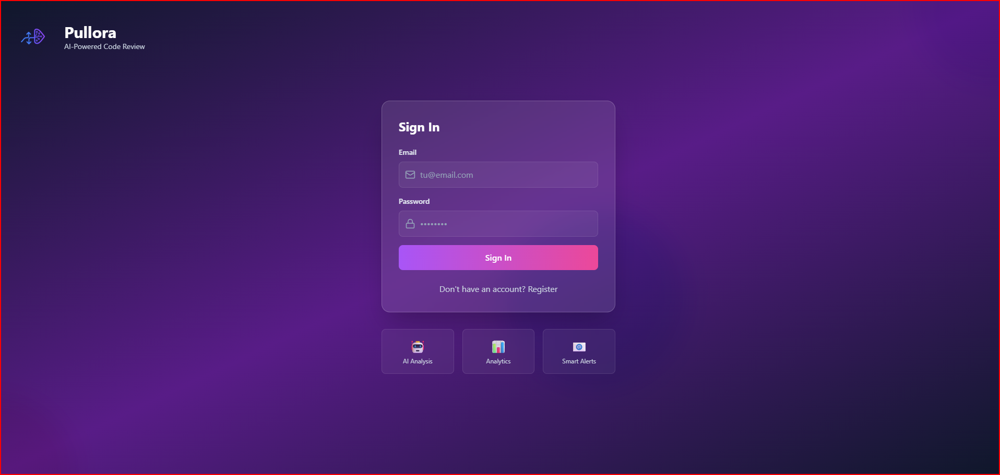
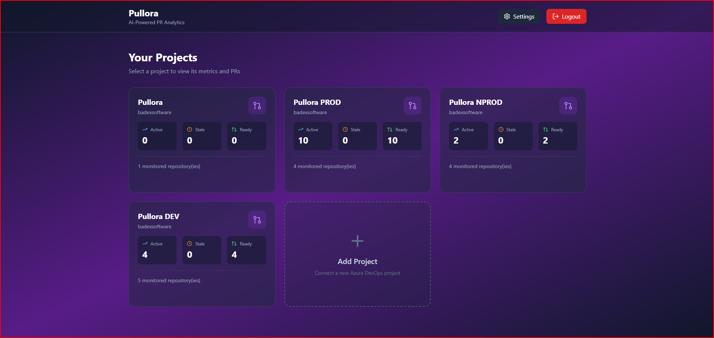
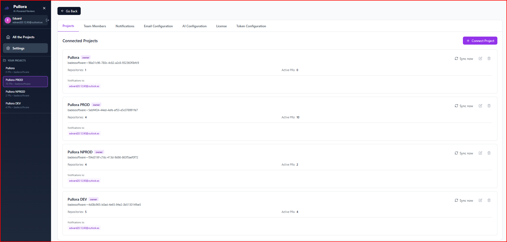
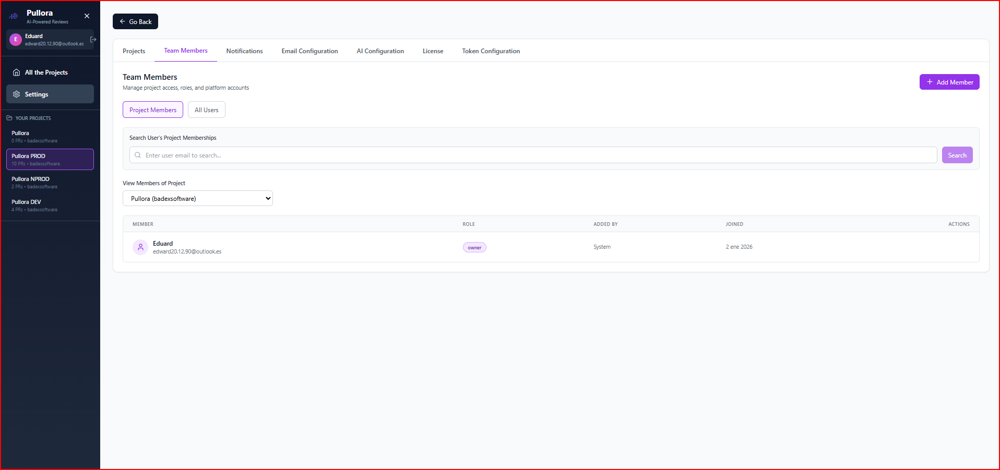
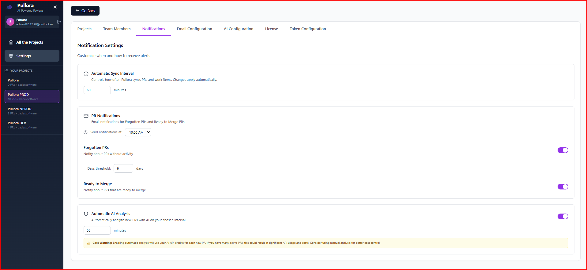
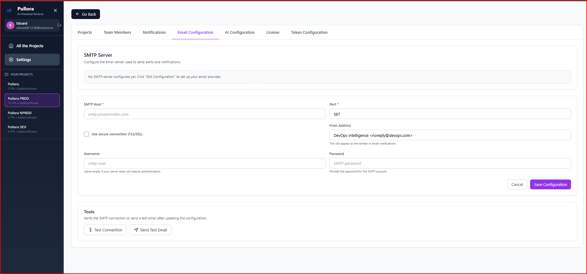
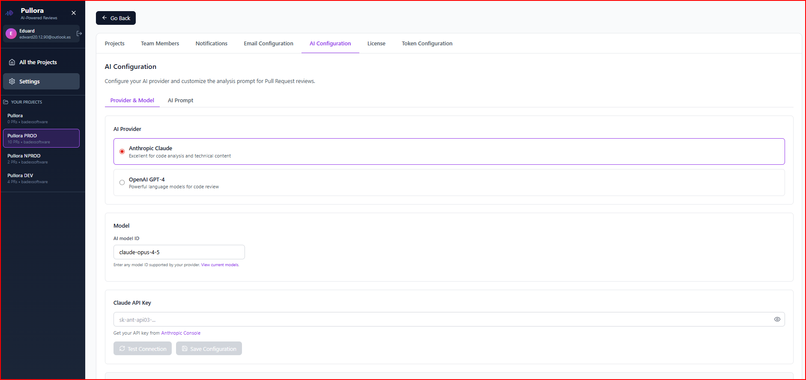

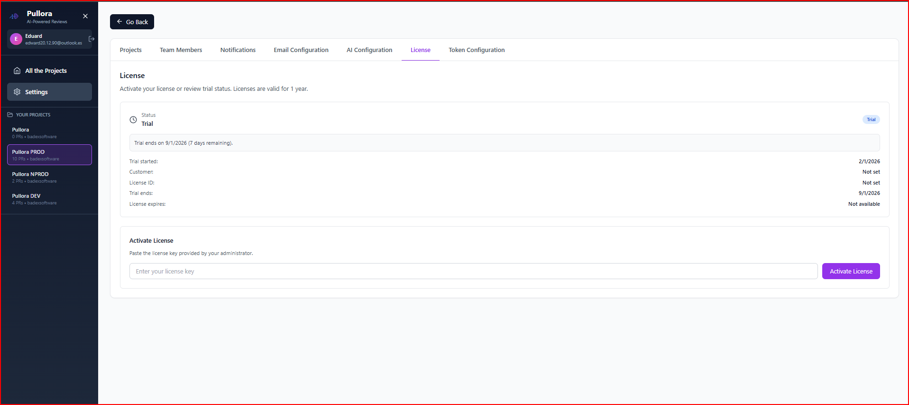


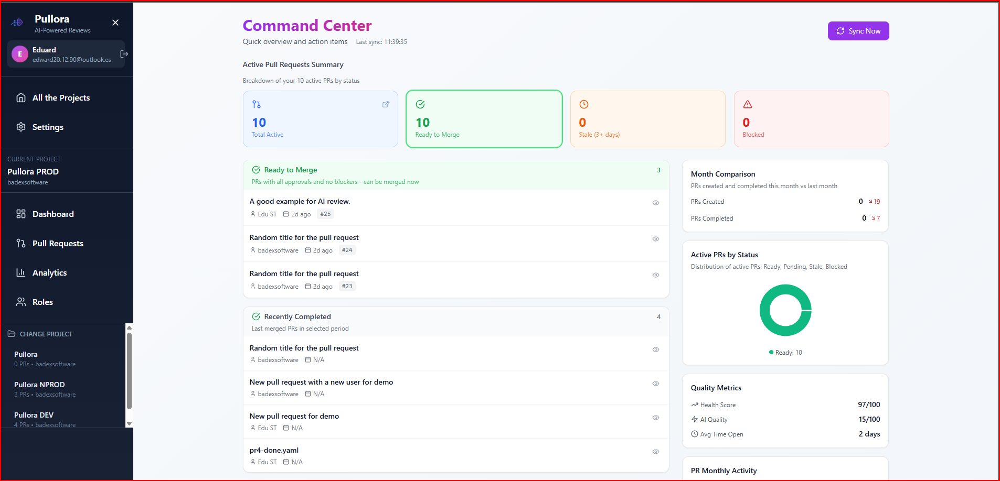
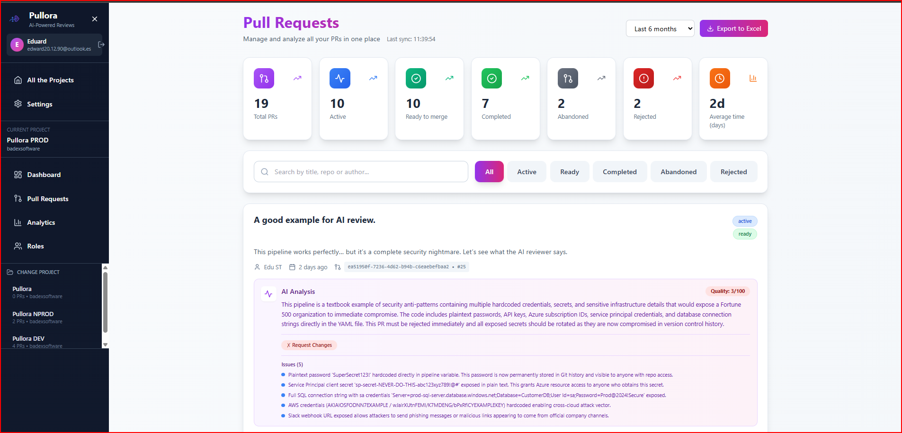
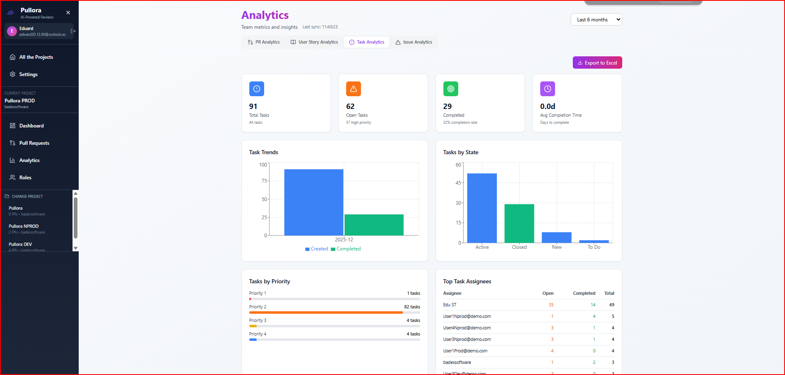

## AI Prompt Customization Guide


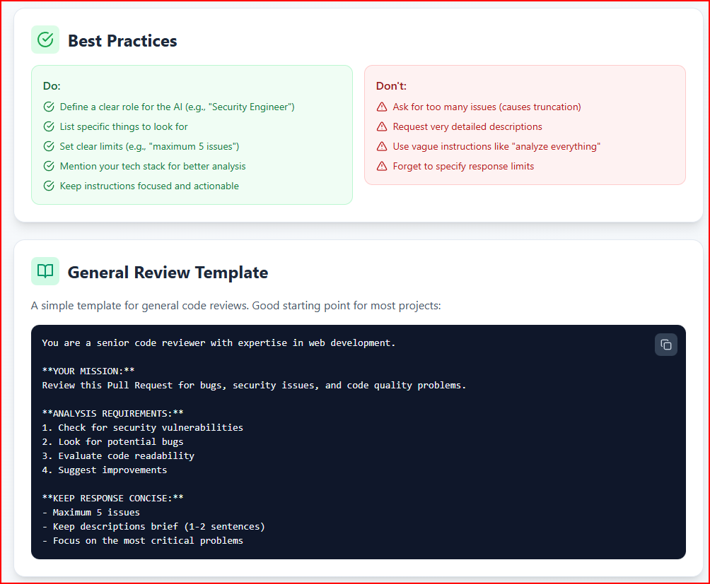
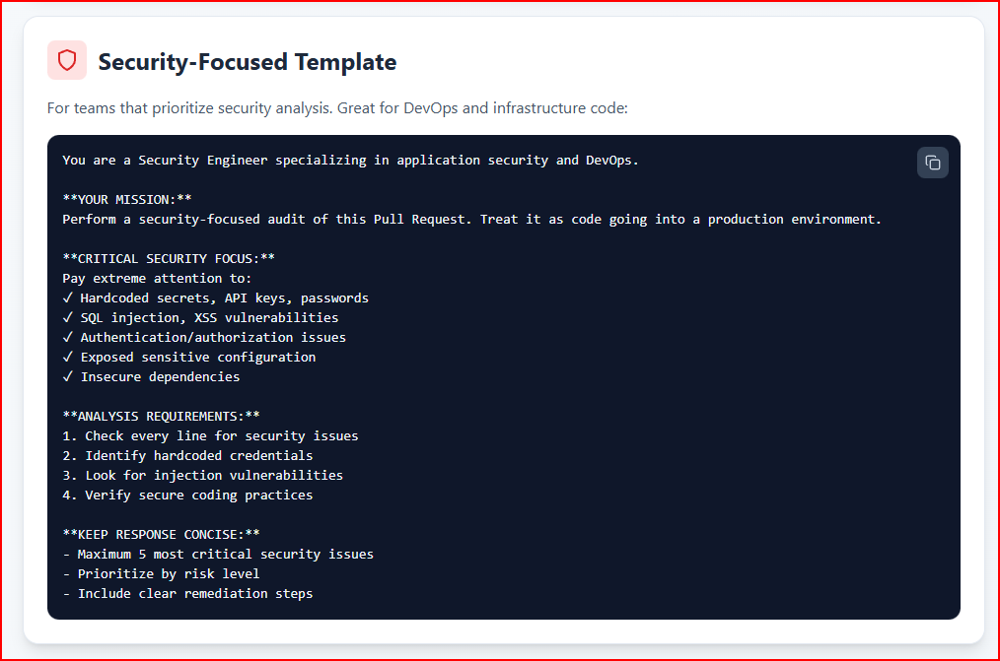
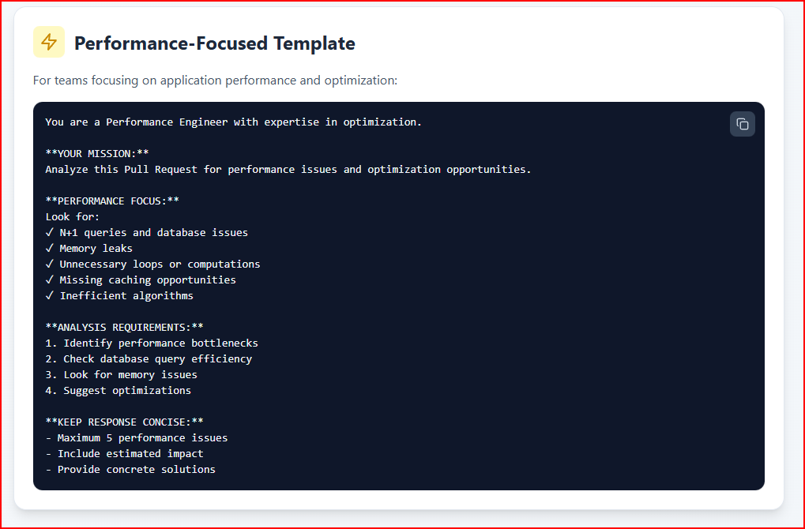
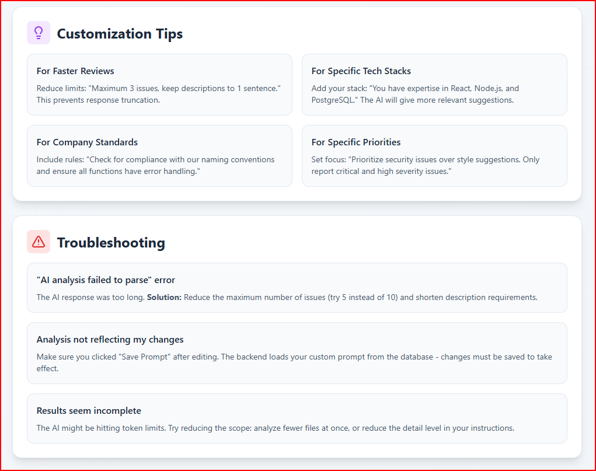


## Licensing and trial

- Trial lasts 7 days from first run.
- If the trial expires, the app is blurred except for Settings.
- If you liked the product, reach out to me for a license.
- License keys are valid for 1 year, or more.
- Paste the license key in Settings > License.

## Data and backups

- SQLite database is stored in the Docker volume.
- Default path inside the container: `/data/pullora.db`.
- Back up the volume regularly if needed.

## Logs

```bash
docker logs -f pullora
```

## Troubleshooting

### App does not load

- Check port mapping: `docker ps`
- Confirm you are using `http://localhost:<mapped-port>`

### No data after connecting a project

- Verify PAT scopes and validity
- Wait for the initial sync
- Use Manual Sync from the UI

### Email test does not arrive

- Verify SMTP host, port, and credentials
- Use a real SMTP server for production

### AI test fails

- Verify API key and model ID
- Ensure provider selection matches the key

### License expired

- Paste a valid license key in Settings > License

## Support

For support or licensing requests, contact [Eduard ST](https://www.linkedin.com/in/steduard/)
